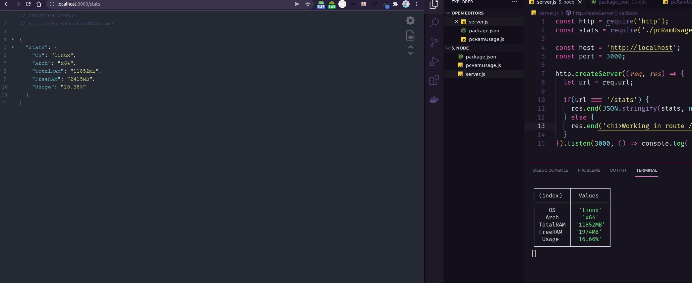

# Monitor de uso da memória RAM

Este projeto desenvolvido com **Node.js** tem como objetivo criar um servidor, subir e devolver uma mensagem em JSON com **informações de uso da memória RAM**.</br></br>

O **Node.js** é um ambiente de execução do **JavaScript** em _**server-side**_.</br>

Ok. Mas o que isso quer dizer?</br> 

Ele nos dá a possibilidade de rodar localmente o JavaScript fora do navegador por exemplo.</br></br> 

## Como surgiu? 

Todo navegador possui um **Interpretador de JavaScript** rodando por trás dos panos para fazer as coisas funcionarem direitinho: </br></br>
* Safari - Nitro
* Mozilla - SpiderMonkey
* Edge - Chakra
* Chrome - V8
</br></br>

Em 2009 um cara chamado Ryan Dahl criou o Node.js a partir do V8 do Chrome.
</br>

### E o que tem isso? 

</br>
Com a criação do Node.js, temos a possibilidade de rodar o JavaScript sem precisar de um navegador, diminuindo o processamento e trabalhando com interpretação _just-in-time_, em tempo real meus amigos.
</br>

### Como assim?

</br>
O Node.js, diferente de outros interpretadores, trabalha com _single-thread_, ou seja, imagina que cada requisição é um pedido de delivery... vai chegar uma hora que o quadro de pedidos vai estar cheio e se tiver um pedido que ainda não foi produzido e entregue, ele vai bloquear a passagem dos outros pedidos, gerando insatisfação dos clientes.
Coitado do entregador.
</br></br>
O Node.js trabalha com requisições **assíncronas**, ou seja, não precisa esperar todos os pedidos, vai entregando o que for ficando pronto. Assim todo mundo sai feliz.
Dessa forma, o processamento é não-bloqueante(_non-blocking_), pois funciona mesmo sem uma requisição estar pronta, do contrário seria bloqueante(_blocking_) e tudo ficaria parado.
</br></br>
Consequentemente, o entregador não precisa mais ficar preocupado e entrega o pedido assim que o mesmo for finalizado, depois volta no quadro de pedidos, pega os que faltaram e entrega logo após. Chamamos isso de _**Event-Loop**_ .</br></br>
Isso tudo em tempo real.
</br></br>


## Tech Stack

- Node.js
</br></br>

## Run Locally

Clone the project

```bash
  git clone https://github.com/wsasouza/dio-node-pc-ram-usage
```

Go to the project directory

```bash
  cd dio-node-pc-ram-usage
```

Start the server

```bash
  node server.js
```

Open the browser at:

```bash
  http://localhost:3000/stats
```


<br>
<br>

## Demo

<h1 align="center">
  
</h1>